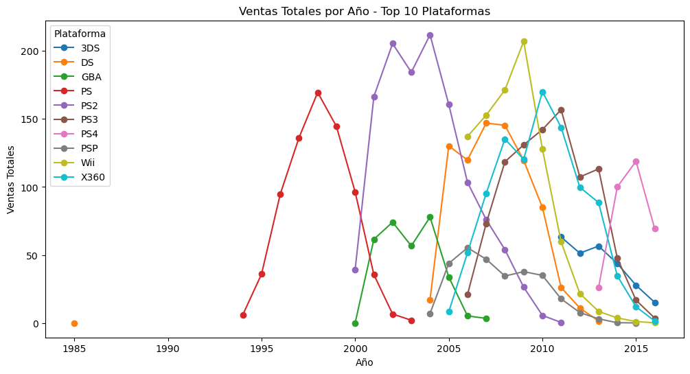
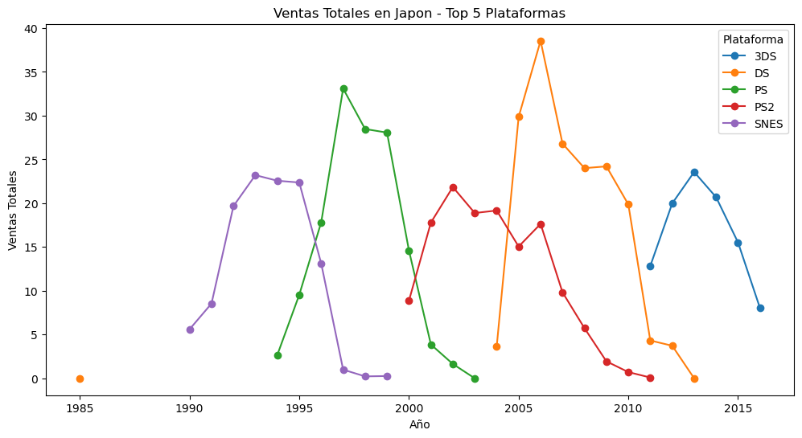
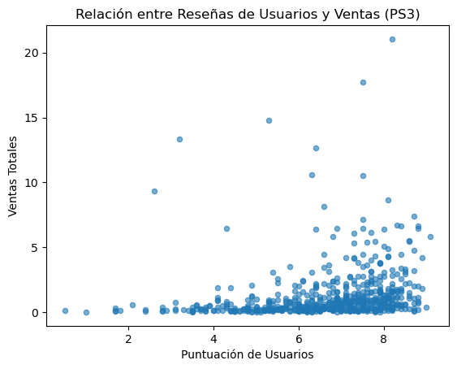

<div align="center">

# 🎮 Análisis Estratégico del Mercado Global de Videojuegos

### Identificación de patrones de éxito para apoyar decisiones de negocio y campañas publicitarias


</div>

---

## 📌 Descripción del Proyecto

La tienda online **Ice**, dedicada a la venta internacional de videojuegos, necesita identificar patrones que permitan comprender qué factores influyen en el éxito comercial de un videojuego.

Utilizando información histórica sobre:

🎮 plataformas  
⭐ reseñas de usuarios  
📰 reseñas de críticos  
🌍 regiones  
📈 ventas globales  
🏷 géneros  
📅 años de lanzamiento  

se desarrolló un análisis exploratorio y estadístico para detectar tendencias de mercado y generar recomendaciones basadas en datos.

---

## 🎯 Objetivo del negocio

Identificar variables y patrones que permitan:

✔ Detectar videojuegos con potencial comercial

✔ Optimizar campañas publicitarias

✔ Entender tendencias de la industria

✔ Reducir riesgos en futuras inversiones

✔ Mejorar decisiones estratégicas

---

## ❓ Preguntas de análisis

Durante el proyecto se buscaron respuestas a preguntas clave:

- ¿Qué plataformas dominan el mercado?
- ¿Cómo evolucionan las ventas con el tiempo?
- ¿Las reseñas impactan las ventas?
- ¿Qué géneros son más rentables?
- ¿Existen diferencias regionales de preferencias?
- ¿Qué plataformas muestran señales de crecimiento?

---

## 📂 Datos utilizados

El análisis se desarrolló utilizando datos históricos del mercado global:

| Variable | Descripción |
|---|---|
| Name | Nombre del videojuego |
| Platform | Plataforma |
| Year_of_Release | Año |
| Genre | Género |
| NA_sales | Ventas Norteamérica |
| EU_sales | Ventas Europa |
| JP_sales | Ventas Japón |
| Other_sales | Otras regiones |
| Critic_Score | Calificaciones expertos |
| User_Score | Calificaciones usuarios |
| Rating | Clasificación ESRB |

---

## ⚙️ Proceso realizado

### 1️⃣ Exploración inicial

- revisión de estructura
- detección de datos faltantes
- validación de variables

---

### 2️⃣ Limpieza y transformación

✔ tratamiento de valores nulos

✔ normalización de nombres

✔ transformación de tipos de datos

✔ creación de ventas globales

✔ preparación para análisis estadístico

---

### 3️⃣ Análisis Exploratorio (EDA)

Se analizaron:

📈 ventas por año

🎮 evolución de plataformas

🌎 preferencias regionales

⭐ relación entre críticas y ventas

🏷 comportamiento por género

---

### 4️⃣ Pruebas estadísticas

Se aplicaron pruebas de hipótesis para validar diferencias entre:

- plataformas
- preferencias regionales
- comportamiento de usuarios

Herramientas:

```python
scipy.stats

ttest_ind()
```

---

## 📊 Hallazgos principales

### 🎮 Ciclo de vida de plataformas

Las plataformas muestran ciclos de vida relativamente cortos.

Los líderes del mercado cambian constantemente, haciendo que las empresas deban adaptarse rápidamente a nuevas tecnologías.

---

### ⭐ Las reseñas de críticos tienen influencia

Se encontró una relación moderada entre:

Calificaciones de críticos → ventas

Las opiniones especializadas pueden impactar significativamente el desempeño comercial.

---

### 🌎 Existen preferencias regionales claras

Las preferencias varían considerablemente:

🇺🇸 Norteamérica

🇪🇺 Europa

🇯🇵 Japón

Cada región presenta comportamientos únicos respecto a géneros y plataformas.

---

### 🕹 Algunos géneros son consistentemente más rentables

Los géneros:

- Action
- Shooter
- Sports

presentaron niveles superiores de ventas globales.

---

## 🚀 Conclusiones

### ✅ El mercado cambia constantemente

La popularidad de plataformas evoluciona rápidamente, reduciendo la vida útil comercial.

---

### ✅ Las decisiones no deben depender de una sola variable

El éxito de un videojuego depende de múltiples factores:

- plataforma
- género
- región
- críticas
- tendencias

---

### ✅ El comportamiento regional es crítico

Las preferencias locales influyen significativamente en ventas y estrategias comerciales.

Una campaña global uniforme podría reducir efectividad.

---

### 🎯 Conclusión final

El análisis demuestra cómo la combinación entre análisis exploratorio y estadística permite transformar datos históricos en información estratégica útil para decisiones comerciales.

Los resultados facilitan la identificación de oportunidades futuras y reducen incertidumbre en campañas publicitarias.

---

## 📷 Vista del proyecto

<div align="center">

### 📊 Ventas globales por plataforma (Top 10 plataformas)



### 🌍 Preferencias por región (Japón)



### ⭐ Relación entre reseñas y ventas (PS3)



</div>

---

## 🛠 Tecnologías utilizadas

| Herramienta | Uso |
|---|---|
| Python | análisis |
| Pandas | manipulación |
| NumPy | procesamiento |
| Matplotlib | visualización |
| Seaborn | EDA |
| SciPy | estadística |
| Jupyter Notebook | desarrollo |

---

## 👨‍💻 Autor

**Carlos Guerrero**

Administrador de Negocios Internacionales → Data Analyst

📊 Python | SQL | Visualización | Estadística | Storytelling con datos

[](https://www.linkedin.com/in/carlosguerrero9923)

[](https://github.com/carlosguerrero9923)

[](mailto:carlosguerrero9923@gmail.com)
